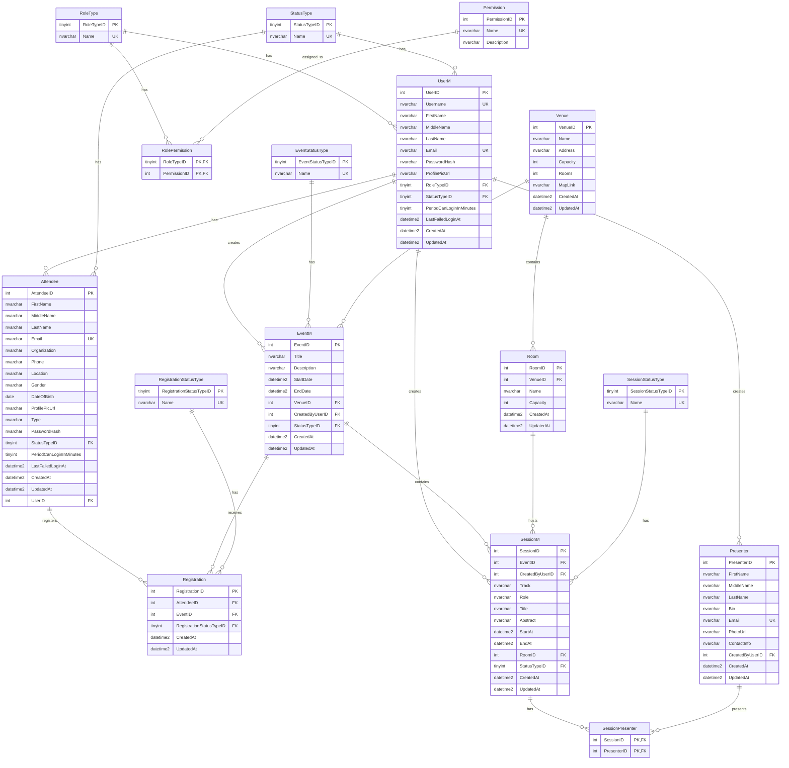

# Eventra Database - Entity Relationship Diagram (ERD)

## Database Overview
**Database Name:** EventPlannerDB  
**Purpose:** Event management system for planning, organizing, and managing events with user roles, registrations, and session management.

---

## Entity Relationship Diagram

---

## Table Descriptions

### Core User Management
- **UserM**: Main user table storing all system users (admins, organizers, attendees)
- **RoleType**: Defines user roles (SuperAdmin, Admin, Staff, Attendee)
- **StatusType**: User status (Active, Inactive, Suspended, etc.)
- **Permission**: System permissions for role-based access control
- **RolePermission**: Many-to-many relationship between roles and permissions

### Attendee Management
- **Attendee**: Extended user information for event attendees
- Links to UserM through UserID foreign key

### Event Management
- **EventM**: Main events table with all event details
- **EventStatusType**: Event status (Draft, Published, Cancelled, etc.)
- **Venue**: Event venues with capacity and location information
- **Room**: Individual rooms within venues

### Registration System
- **Registration**: Links attendees to events they've registered for
- **RegistrationStatusType**: Registration status (Pending, Confirmed, Cancelled, etc.)

### Session Management
- **SessionM**: Individual sessions within events
- **SessionStatusType**: Session status (Scheduled, In Progress, Completed, etc.)
- **SessionPresenter**: Many-to-many relationship between sessions and presenters

### Presenter Management
- **Presenter**: Information about event presenters/speakers
- **SessionPresenter**: Links presenters to specific sessions

---

## Key Relationships

### One-to-Many Relationships
- **UserM → Attendee**: One user can have one attendee record
- **UserM → EventM**: One user can create many events
- **UserM → SessionM**: One user can create many sessions
- **UserM → Presenter**: One user can create many presenters
- **Venue → Room**: One venue can have many rooms
- **EventM → SessionM**: One event can have many sessions
- **EventM → Registration**: One event can have many registrations

### Many-to-Many Relationships
- **SessionM ↔ Presenter**: Through SessionPresenter junction table
- **RoleType ↔ Permission**: Through RolePermission junction table

### Foreign Key Constraints
- All relationships maintain referential integrity
- Cascade delete/update rules applied where appropriate
- Check constraints ensure data validity (e.g., EndDate >= StartDate)

---

## Data Flow

1. **User Registration**: Users are created in UserM, then attendee records are created in Attendee
2. **Event Creation**: Users with appropriate roles can create events in EventM
3. **Session Planning**: Events can have multiple sessions with presenters
4. **Registration**: Attendees can register for events through the Registration table
5. **Role-Based Access**: Permissions are managed through RoleType and Permission tables

---

## Database Constraints

### Primary Keys
- All tables have auto-incrementing primary keys
- Composite primary keys for junction tables

### Unique Constraints
- Username and Email in UserM
- Email in Attendee and Presenter
- Name fields in type tables

### Check Constraints
- EventM: EndDate >= StartDate
- SessionM: EndAt > StartAt

### Foreign Key Constraints
- All relationships properly defined with appropriate cascade rules
- Referential integrity maintained across all tables 